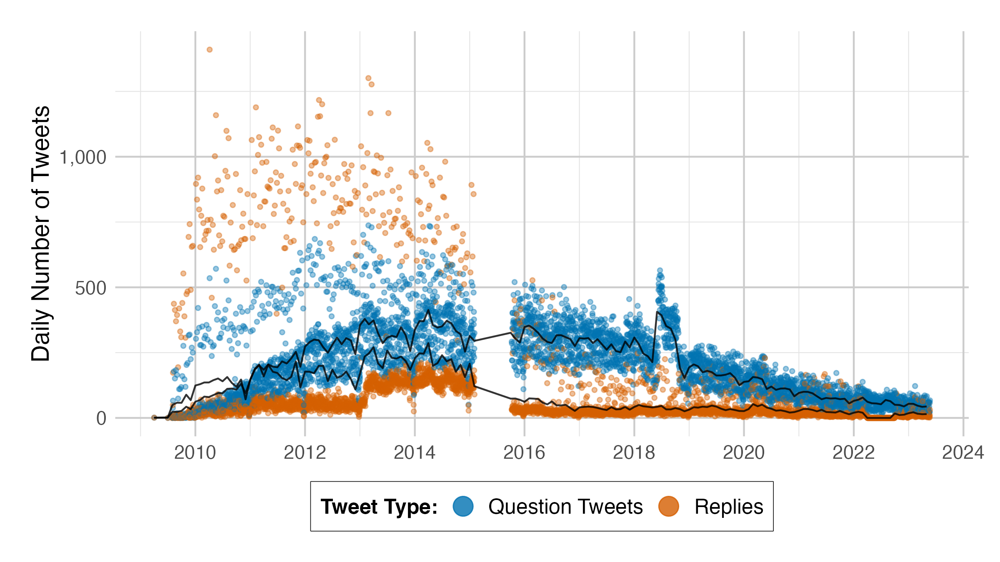

```{r setup, include=FALSE}
usethis::use_git_ignore(c("*.csv", "*.rds"))
options(htmltools.dir.version = FALSE)

library(knitr)
library(tidyverse)
library(xaringan)
library(fontawesome)
```

class: inverse, center, middle

# `r fa("fas fa-images", fill = "#fff")`

**View the slides:**

[bretsw.com/aect24-edchat](https://bretsw.com/aect24-edchat)


---

class: inverse, center, middle

# `r fa("fas fa-crow", fill = "#fff")` <br><br> Once upon a time...

---

# `r fa("fas fa-crow", fill = "#fff")` Once upon a time...

--

On March 21, 2006, @jack posted 

--

`"just setting up my twttr"`

--

<hr>

### A lot has changed in 18 years

--

```{r, out.width = "540px", echo = FALSE, fig.align = "center"}

```

---

# `r fa("fas fa-crow", fill = "#fff")` Hello, Twitter.

**March 21, 2006:** Twitter launched for public use. Tweet length limited to 140 characters.

--

**July 2, 2009:** Hashtags (i.e., keywords preceded by the “#” symbol) included in tweets automatically become hyperlinks that connect users to the search results of all tweets containing that hashtag.

--

**November 6, 2009:** Retweet button added to the Twitter user interface, allowing users to easily rebroadcast content to their own followers.

--

**November 7, 2017:** Tweet length expanded to 280 characters.

--

**May–July, 2018:** Twitter changes policy on bot activity and begins removing millions of accounts.

--

**November 15, 2021:** Twitter API v2 becomes the primary API.

---

# `r fa("fas fa-crow", fill = "#fff")` Hello, Twitter.

**October 28, 2022:** Elon Musk purchases Twitter, transforming the platform into a privately owned company.

--

**February 9, 2023:** Twitter ends free access to its API, both v1 and v2.

--

**Spring 2023:** Tweet length expanded to 4,000 characters (for paid users) on February 8, to 10,000 characters on April 14, and to 25,000 characters on June 27.

--

**June 2023:** Twitter ends access to the Academic API.

--

**July 23, 2023:** Twitter’s name is changed to X.

---

# `r fa("fas fa-crow", fill = "#fff")` Scholarly Interest

X/Twitter has garnered a lot of attention from academic researchers

--

```{r, out.width = "450px", echo = FALSE, fig.align = "center"}

```

<div class="caption">
Image source: <a href="https://www.connectedpapers.com/main/703c67511a6bc9c6db4993512aa18d036653ba94/graph">Connected Papers</a>
</div>

---

# `r fa("fas fa-crow", fill = "#fff")` Shift in Scholarly Focus

### Individual use `r fa("fas fa-arrow-right", fill = "#782F40")` Spaces for learning

```{r, out.width = "100%", echo = FALSE, fig.align = "center"}
include_graphics("img/seasons.png")
```

---

# `r fa("fas fa-crow", fill = "#fff")` Platforms Change

```{r, out.width = "100%", echo = FALSE, fig.align = "center"}

```

<div class="caption">
Image source: <a href="https://www.techspot.com/news/51337-new-myspace-goes-live-focuses-on-social-music.html">TechSpot</a>
</div>


---

class: inverse, center, middle

# `r fa("fas fa-crow", fill = "#fff")` <br><br> Purpose: <br> Evolution of Spaces

---

class: inverse, center, middle

# `r fa("fas fa-crow", fill = "#fff")` `r fa("fas fa-arrow-right", fill = "#fff")` `r fa("fas fa-skull", fill = "#fff")`<br><br> Purpose: <br> Evolution of Spaces


---

class: inverse, center, middle

# `r fa("fas fa-map", fill = "#fff")` <br><br> Method

---

# `r fa("fas fa-map", fill = "#fff")` Method: Overview

```{r, out.width = "540px", echo = FALSE, fig.align = "center"}
include_graphics("img/skeleton-plan.png")
```

--

- `r fa("fas fa-crow", fill = "#782F40")` X/Twitter hashtag \#Edchat

--

- `r fa("fas fa-calendar", fill = "#782F40")` 2008 to 2023

--

Questions:

- RQ1: **Popularity** of \#Edchat as a space for educators’ professional learning (i.e., **volume**) changed over time
- RQ2: **Relevance** of \#Edchat tweets for educators’ professional learning (i.e., **content**) changed over time


---

# `r fa("fas fa-map", fill = "#fff")` Method: Research Design

```{r, out.width = "540px", echo = FALSE, fig.align = "center"}
include_graphics("img/skeleton-plan.png")
```

--

**Quantitative approach:**

--

\+ **naturalistic inquiry** (unobtrusive, not disrupting)

--

\+ **at scale** (reaction across education)

--

= **data mining** (digital traces)


---

# `r fa("fas fa-bucket", fill = "#fff")` Data Collection

```{r, out.width = "540px", echo = FALSE, fig.align = "center"}

```

### Digital traces:

--

<hr>

All tweets containing keyword text **"#edchat"**

--

Retrieved using **R**, a combination of open packages and custom code

--

**16,898,906 tweets**

--

October 25, 2008 to May 23, 2023 (14 years, six months, and 28 days) 


---

# `r fa("fas fa-gauge-high", fill = "#fff")` Data Analysis

```{r, out.width = "600px", echo = FALSE, fig.align = "center"}

```

--

### RQ1: Popularity for educators’ professional learning

- 5 measures of volume changing over time

--

### RQ2: Relevance for educators’ professional learning

- 7 measures of content changing over time


---

class: inverse, center, middle

# `r fa("fas fa-volume-high", fill = "#fff")` `r fa("fas fa-arrows-to-circle", fill = "#fff")` <br><br> Results

---

# `r fa("fas fa-volume-high", fill = "#fff")` Popularity (Volume)

```{r, out.width = "100%", echo = FALSE, fig.align = "center"}

```

### Original Tweets and Retweets

---

# `r fa("fas fa-volume-high", fill = "#fff")` Popularity (Volume)

```{r, out.width = "100%", echo = FALSE, fig.align = "center"}

```

### Original Tweets on Tuesdays vs. Other Days

---

# `r fa("fas fa-volume-high", fill = "#fff")` Popularity (Volume)

```{r, out.width = "100%", echo = FALSE, fig.align = "center"}

```

### Replies and Original Tweets with Questions

---

# `r fa("fas fa-volume-high", fill = "#fff")` Popularity (Volume)

```{r, out.width = "100%", echo = FALSE, fig.align = "center"}

```

### Percentage of Questions and Replies in Original Tweets

---

# `r fa("fas fa-volume-high", fill = "#fff")` Popularity (Volume)

```{r, out.width = "100%", echo = FALSE, fig.align = "center"}

```

### Mean Number of Favorites and Retweets of Original Tweets


---

# `r fa("fas fa-arrows-to-circle", fill = "#fff")` Relevance (Content)

```{r, out.width = "100%", echo = FALSE, fig.align = "center"}

```

### Mean Number of Characters in #Edchat Original Tweets

---

# `r fa("fas fa-arrows-to-circle", fill = "#fff")` Relevance (Content)

```{r, out.width = "100%", echo = FALSE, fig.align = "center"}

```

### Percentage of Original Tweets with Hyperlinks

---

# `r fa("fas fa-arrows-to-circle", fill = "#fff")` Relevance (Content)

```{r, out.width = "100%", echo = FALSE, fig.align = "center"}

```

### Mean Number of Hashtags in Original Tweets 

---

# `r fa("fas fa-arrows-to-circle", fill = "#fff")` Relevance (Content)

```{r, out.width = "450px", echo = FALSE, fig.align = "center"}

```

### Top-10 Hashtags in Original Tweets by Year

---

# `r fa("fas fa-arrows-to-circle", fill = "#fff")` Relevance (Content)

```{r, out.width = "100%", echo = FALSE, fig.align = "center"}

```

### Content That is Favorited vs. Not

---

# `r fa("fas fa-arrows-to-circle", fill = "#fff")` Relevance (Content)

```{r, out.width = "100%", echo = FALSE, fig.align = "center"}
include_graphics("img/fig11.png")
```

### Content That is Retweeted vs. Not

---

# `r fa("fas fa-arrows-to-circle", fill = "#fff")` Relevance (Content)

```{r, out.width = "100%", echo = FALSE, fig.align = "center"}

```

### Mean LIWC Characteristics of Original Tweets


---

class: inverse, center, middle

# `r fa("fas fa-comments", fill = "#fff")` <br><br> Reflection & Discussion

---

# `r fa("fas fa-comments", fill = "#fff")` Shelf-Life of Spaces


--

**Similar to Rise and Fall of MySpace**

<div class="caption">

</div>

---

# `r fa("fas fa-comments", fill = "#fff")` Case of 2018

### Technological + Social Factors for Change


---

# `r fa("fas fa-comments", fill = "#fff")` Paradox of Success

### Success Can Lay the Foundation for Decline


---

# `r fa("fas fa-skull", fill = "#fff")` This Is Where We Leave You

```{r, out.width = "100%", echo = FALSE, fig.align = "center"}

```

---

# `r fa("fas fa-rocket", fill = "#fff")` Future Directions

```{r, out.width = "600px", echo = FALSE, fig.align = "center"}

```

--

- Digital traces can flag changes and mark where to pay attention

--

- In research, we must strive to get as much **context** and **perspective** as possible

--

- In practice, we must work to increase **digital literacy** to navigate the paradoxes


---

class: inverse, center, middle

# `r fa("fas fa-question", fill = "#fff")` <br><br> Questions

<br><br>

**Bret Staudt Willet + Jeff Carpenter + Hunhui Na**

Florida State University + Elon University

<br>
<hr>

`r fa("envelope", fill = "#fff")` [bret.staudtwillet@fsu.edu](mailto:bret.staudtwillet@fsu.edu) | `r fa("globe", fill = "#fff")` [bretsw.com](https://bretsw.com) | `r fa("fab fa-github", fill = "#fff")` [GitHub](https://github.com/bretsw/)

<hr>

<div class="caption">
Images created with Midjourney. Slides made with RMarkdown.
</div>